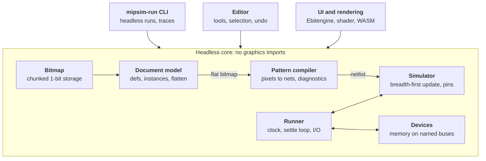

# MiPSim v2: development plan

Oct 7, 2026 · @Noé

## Context

MiPSim v2 is a rewrite of [Castux/mipsim](https://github.com/Castux/mipsim) in Go, with a one-bit pixel editor, reusable components, and attachable memory. This document is the handover for an AI agent building it. Sections 3 (tile semantics), 4 (simulation), 5 (components and labels) and 6 (devices), plus the file format, are the spec; from M0 onward the authoritative copy is `docs/SPEC.md` (see rules for the agent).

v1 is a browser editor written in Lua and run through Fengari. Its core is three files: `Geom.lua` (613 lines, tiles to components and connections), `Simulator.lua` (268 lines) and `Canvas.lua` (735 lines, editor). Circuits are grids of five tile types: wire, power, ground, transistor, bridge. The largest real design is `bf-proc/`, a Brainfuck processor whose program and data RAM are emulated by a Lua host (`BFHost.lua`) reading and driving named wires after each clock edge.

What v2 changes:

- **Tiles:** one pixel type. Function comes from local pixel patterns, not tile kinds.
- **Reuse:** a rectangular region can be made a component and placed many times. All placements are live views of one shared definition, always drawn fully expanded.
- **Memory:** RAM and ROM become simulator devices attached to named buses, replacing hand-built RAM and ad hoc host scripts.
- **Runtime:** Go, native window on desktop, same code compiled to WebAssembly for the browser, plus a headless mode with no graphics dependency.

What stays: the n-MOS switch-level model, low-wins-over-high, labels and the `name_N` number convention, breadth-first propagation with oscillation detection, and forcing (pinning) wires from the UI or host code.

## Goals and non-goals

Goals, in priority order:

1. A deterministic headless simulator library and CLI that can run a processor-scale circuit (bf-proc size or larger) with attached memory, driven by a clock.
2. A pattern compiler that turns a one-bit bitmap into a netlist and reports every ambiguous or malformed pattern as a located diagnostic, never silently guessing.
3. An editor on desktop and web from one codebase: draw, select, copy, cut, paste, move, undo, label, make and place components, simulate and force wires.
4. Live component definitions: editing any instance edits all of them immediately.

Non-goals for v2.0:

- Automatic conversion of v1 files. The geometry rules differ (v1 transistors are single tiles), so example circuits are redrawn by hand.
- Analog effects, timing, propagation delay, charge storage on floating nodes (see open questions).
- Collaborative or multi-user editing.

## Tile semantics (spec)

The circuit is a set of "on" pixels on an unbounded integer grid. Connectivity is orthogonal only: diagonal neighbours never connect. Wires are one pixel wide. Every on or off pixel classifies into exactly one role below, or produces a diagnostic.

The five patterns, `#` on and `.` off (the centre pixel is the one being classified):

```
High source   Low source    Transistor    Bridge        Wire junction
  ###           ###           .#.           .#.           .#.
  ###           #.#           ###           #.#           ###
  ###           ###           ...           .#.           .#.
```

- **High source:** a 3×3 fully on square. Drives its net high.
- **Low source:** a 3×3 ring (8 on, centre off). Drives its net low.
- **Transistor:** an on pixel with exactly three on orthogonal neighbours, outside any source. The two collinear arms are the channel (source/drain, interchangeable); the perpendicular arm is the gate. This is deterministic, unlike v1, which picked randomly when ambiguous. In the picture above, left and right are the channel and the top arm is the gate.
- **Bridge:** an off pixel whose four orthogonal neighbours are on and four diagonal neighbours are off. Connects north to south and west to east, independently.
- **Wire:** every other on pixel. A cross with its centre on is a plain 4-way junction; a 3-way split is drawn as a cross with one arm left as a one-pixel stub.

A source connects to any on pixel orthogonally adjacent to its outer edge. A transistor arm may touch a source (the arm pixel is a wire pixel adjacent to the source's edge). A transistor centre directly adjacent to a source's edge always forms a 2×2 block with it and is `E_THICK`, except at a source corner.

Because recognition is purely local, any 3×3 loop of wire is a low source, and a wire grid with a pitch of 2 pixels produces `E_RING_OVERLAP`. This is intended; the classification goldens include both cases and the user guide calls it out.

### Recognition order

The compiler classifies in this order so the patterns cannot steal pixels from each other:

1. **Thick regions.** Find every 2×2 block of on pixels and union the overlapping ones into thick regions. Each thick region must be exactly a 3×3 square, which becomes a high source. Anything else is error `E_THICK` (for example a 3×4 block, or a wire running flush along a source's side).
2. **Rings.** Every 3×3 window with 8 on pixels and an off centre is a low source. Overlapping rings, or a ring sharing pixels with a high source, is error `E_RING_OVERLAP`.
3. **Transistors.** Among remaining on pixels, those with exactly 3 on orthogonal neighbours (counting source pixels as on).
4. **Bridges.** Off pixels with 4 on orthogonal and 0 on diagonal neighbours. An off pixel with 4 on orthogonal neighbours and 1 to 3 on diagonals is error `E_GAP_AMBIGUOUS`, because the diagonal pixel would silently short two arms.
5. **Wires.** Everything else that is on.

### Lint rules

These keep the language unambiguous. Errors block simulation; warnings do not.

| Code | Level | Condition |
| --- | --- | --- |
| `E_THICK` | error | A thick region that is not exactly 3×3 |
| `E_RING_OVERLAP` | error | Rings overlapping each other or a high source |
| `E_GAP_AMBIGUOUS` | error | Bridge-like gap with on diagonals |
| `E_ADJ_TRANSISTOR` | error | A transistor arm is itself a transistor centre |
| `E_BRIDGE_ARM` | error | A bridge arm pixel is a transistor centre |
| `E_LABEL_OFF_NET` | error | A label sits on an off pixel or a transistor centre (for example after the pixel under it was erased) |
| `W_CHANNEL_SHORT` | warning | A transistor's two channel arms are already the same net |
| `W_GATE_ON_CHANNEL` | warning | Gate net equals a channel net |
| `W_FLOATING_GATE` | warning | Gate net has no source, no label and no transistor channel feeding it |
| `W_DIAGONAL_TOUCH` | warning | Two on pixels in different nets touch only diagonally, unless both are arms of the same transistor or the same bridge |
| `W_SOURCE_SHORT` | warning | One net contains both a high and a low source (it is permanently low) |
| `W_LABEL_CONFLICT` | warning | One net carries two different labels from the same scope (both kept as aliases). Labels from different levels of the hierarchy, such as `a` in the parent and `g1.a` on an instance port, are the normal way to connect components and do not warn |

**Two candidate rules, decided by experiment in M2.** The rules above are derived from the owner's base ideas (3×3 square, 3×3 ring, T, cross without centre). Implement recognition behind a switch with two variants and pick one from fixtures:

- **Thin wires (default):** `E_THICK` as above. Every wire is one pixel wide; simple and unambiguous.
- **Isolated sources:** a source must have an empty one-pixel border, except for single-pixel wire attachments that are not adjacent to each other. Thick regions elsewhere are then legal wire, allowing wide buses for visual effect or more elegant components. In this variant, a pixel is only a transistor if neither it nor its three arms belong to a 2×2 block, and a thick region that matches a source shape but lacks the border is error `E_SOURCE_BORDER`.

The fixture set must include cases that the two variants classify differently (a 3×4 block, a wire flush along a source, a T on the edge of a thick wire), so the comparison is concrete.

## Simulation model (spec)

The simulator runs on a compiled netlist, never on pixels. It keeps v1's breadth-first algorithm from `Simulator:update`, ported with deterministic ordering.

### Netlist

The compiler unions wire and source pixels by orthogonal adjacency into **nets**. Transistor centres do not join their neighbours. Bridge gaps join their north arm to their south arm and their west arm to their east arm. NetIDs are assigned canonically: nets are numbered in raster order (y, then x) of their first pixel, and transistors in raster order of their centre. The same bitmap always yields the same netlist, whatever order the chunks were stored or the pixels were visited in. The output is:

```go
type NetID int32

type Net struct {
    Drive  Drive    // None, High, Low (from sources it contains)
    Names  []string // hierarchical labels, see section 5
}

type Transistor struct {
    Gate NetID
    A, B NetID // channel, interchangeable
}

type Netlist struct {
    Nets        []Net
    Transistors []Transistor
    GatedBy     [][]int32 // net -> transistors it gates (CSR in practice)
    ChannelOf   [][]int32 // net -> transistors it is a channel of
    PixelNet    PixelMap  // for rendering and hit-testing
    Diagnostics []Diagnostic
}
```

### State and values

Each net holds one of `Floating`, `High`, `Low`, `Unstable`. A transistor conducts only when its gate net is `High`; a `Floating`, `Low` or `Unstable` gate does not conduct, as in v1. A **group** is the set of nets reachable from a net through conducting transistors. A group's value is `Low` if it contains a low source or a net pinned low, else `High` if it contains a high source or a net pinned high, else `Floating`. Low wins, as in v1, because high sources model pull-up resistors.

### Update (breadth-first)

The simulator owns a persistent FIFO queue of nets. `Update(net)` only pushes onto it; nothing is evaluated until the queue is drained. `Step()` processes one queue entry:

1. Pop a net; flood-fill its group through conducting transistors; compute the group value.
2. If any transistor gated by a net in the group has a flip count above the flip threshold (default 20, configurable; "above" as in v1, so the 21st flip trips it), the value is `Unstable`.
3. Assign the value to every net in the group, skipping nets already `Unstable` (they stay locked for the rest of this settle).
4. For each net whose value changed, for each transistor it gates whose conduction flipped: increment its flip count and push channel net A; push B too only when the transistor turned off (when it turns on, A and B are in one group already). This is v1's `sd1`/`sd2` rule. When a gate goes `Unstable`, its transistors stop conducting but their channel nets are not pushed, as in v1.

`Settle()` loops `Step()` until the queue is empty, then resets all flip counts to zero. A settle is therefore the unit v1 calls one `update()` call.

**Unstable clears at the next settle (differs from v1).** When a settle begins (the first `Step()` after the queue was empty), every `Unstable` net becomes `Floating` and is pushed, in ascending ID order, after the entries already queued. A real oscillator goes `Unstable` again within that settle; a transient glitch recovers. v1 kept `Unstable` until a full reset. Duplicate entries in the queue are allowed, as in v1; deduplicating is an optimisation that must not change traces.

The editor's slow-motion view calls `Step()` and redraws between calls, replacing v1's coroutine yield. A step is one queue entry, which is coarser than v1's yield per component; that is acceptable.

**Determinism is a hard requirement.** v1 iterates Lua tables with `pairs`, so ties resolve arbitrarily; Go map iteration is randomised on purpose. Use slices indexed by `NetID`, iterate in ascending order, and never range over a map in `bitmap/`, `doc/` (flatten), `netlist/`, `sim/` or `runner/`. The chunked bitmap exposes chunks and pixels in sorted order (chunk y, chunk x, then raster within the chunk); flatten walks instances in their slice order. Two runs of the same circuit and inputs must produce identical traces.

### Pins and clock

`Pin(net, High|Low)` forces a net and `Unpin(net)` releases it; both only record the pin and call `Update(net)` (push). The caller decides when to `Settle()` or `Step()`. The editor settles immediately after a click, except in slow motion; the runner settles once after all pins for a half period are set. Pinned nets act as sources in step 1, and low still wins, so pinning high cannot override a conducting path to ground (v1 behaviour). The runner drives a clock by toggling a pinned net, by default the one labelled `clock` (configurable): each half period is pin, then the settle loop of section 6. `Tick(n)` runs n full periods. Initial setup sets every net `Floating`, pushes every source net in ascending ID order, and settles, as v1 does.

The same netlist and simulator back the editor, the CLI and the tests. Nothing in `sim/` knows about pixels or graphics.

## Components and instances

A document is a tree of **definitions**. Each instance is a placement of a definition; there is no privileged "original", only the shared definition that every instance displays and edits.

```go
type Definition struct {
    ID        DefID
    Name      string
    W, H      int            // the rectangle; pixels live in [0,W)x[0,H)
    Origin    Point          // root only: world position of local (0,0); zero elsewhere
    Pixels    Bitmap         // local coordinates
    Labels    []Label        // {X, Y, Name}, on wire or source pixels
    Instances []Instance     // children
}

type Instance struct {
    ID   InstID
    Def  DefID
    X, Y   int    // top-left of the placed (oriented) rectangle, in the parent's coordinates
    Orient Orient // one of the 8 rotations and mirrorings of the square
    Name   string // used for hierarchical labels; auto-generated on creation and saved
}

type Orient struct {
    Flip bool  // mirror left-right in local coordinates first: x -> W-1-x
    Rot  uint8 // then rotate clockwise by Rot*90 degrees (0..3)
}

type Document struct {
    Root    DefID         // unbounded; W,H ignored
    Defs    map[DefID]*Definition
    Devices []DeviceConfig // section 6
    Version int
}
```

**Orientation.** Instances can be rotated and mirrored from v2.0. An instance's placed rectangle is W×H, or H×W when `Rot` is odd. All five patterns are symmetric under every rotation and mirroring, so recognition needs no orientation logic: flatten applies the transform, and the compiler sees ordinary pixels. Orientations compose: a rotated instance inside a mirrored instance is transformed by both, applied from the innermost outward. All geometry (flatten, hit-testing, label positions, rectangle checks) goes through one `Orient` type in `doc` with `Apply`, `Inverse` and `Compose`, tested exhaustively over all 8×8 pairs.

**Invariants**, checked after every edit command and on load (rectangles are the placed, oriented ones):

- The definition graph is acyclic (a definition cannot contain itself at any depth).
- Sibling instance rectangles do not overlap.
- A parent has no pixels or labels inside a child instance's rectangle. Instance rectangles are opaque.
- Every child instance lies fully inside its parent definition's rectangle (the root is unbounded).
- The root definition is never instanced.
- Instance names are unique among siblings, non-empty and contain no `.`.

Definitions with no instances stay in the document and the palette until the user deletes them from the palette.

**Flattening.** For compilation and rendering, the document flattens into one world bitmap. The instance path behind a world pixel is not stored per pixel; it is found on demand by descending the instance tree, which is the same walk editing uses. Patterns spanning an instance boundary are legal and recognised normally, since recognition runs on the flat bitmap. A wire in the parent touching a child's edge pixel connects. Store the world bitmap in chunks (64×64 bits per chunk in a map keyed by chunk coordinate) so the canvas is unbounded and empty space costs nothing.

**Editing.** Every editor action resolves a world coordinate to (definition, local coordinate) by descending to the deepest instance whose rectangle contains it, mapping through each instance's inverse orientation on the way down. A pixel edit therefore changes the definition (in its own unrotated frame), and every instance updates on the next flatten. Root-level pixels resolve to the root definition. Commands that would break an invariant are rejected with a status message.

**Component operations:**

- *Make component*: selection rectangle becomes a new definition; its pixels, labels and fully contained instances move into it; one instance with identity orientation replaces them in place.
- *Rotate, mirror*: on a selected instance, composes with its orientation and keeps the rectangle's top-left corner in place (rotating about the centre cannot return to the start after four turns when W and H differ in parity); on a mixed selection, transforms pixels and labels and composes every contained instance's orientation and position.
- *Place instance*: from a component palette, or by pasting a copied instance (paste keeps the link by default).
- *Explode*: replace one instance with a copy of its content in the parent, with its orientation applied; the definition is unaffected.
- *Resize definition*: drag an instance's edge; applies to all instances; rejected if it causes overlaps or cuts off content. The dragged edge is mapped through the instance's orientation to an edge of the definition's local frame. Growing or shrinking the local right or bottom edge only changes `W`/`H`. Moving the local left or top edge shifts the definition's content by the delta, and every instance's `X`/`Y` is adjusted (through its own orientation) so its content stays fixed in the world, all in one undoable command.
- *Rename* instance or definition.

**Labels in components.** A label inside a definition repeats in every instance, so net names are hierarchical: the instance path joined with dots, then the label, e.g. `alu.add3.sum_2`. Root labels have no prefix. The `name_N` number convention applies to the full name, so `alu.result_0` to `alu.result_7` read as the number `alu.result`. A net touched by several labels keeps all of them as aliases.

**Performance.** Recompile the whole flat bitmap after each edit command to start with. A pencil or line drag is one command and recompiles on mouse-up, not on every pixel. The budget is under 50 ms for 1 million on pixels on a laptop; profile before optimising. If it is exceeded, compile each definition once and stamp its netlist per instance, with a boundary pass to stitch nets and recognise patterns along instance edges.

## Memory devices and buses

Devices are Go objects that read and pin labelled nets between settles, generalising `BFHost.handleIO` from v1. The circuit exposes buses as `name_N` labels; the document lists which device attaches to which names.

```go
type Device interface {
    Name() string
    // Called after the circuit settles. Reads nets, pins or unpins nets.
    // Returns true if it changed any pin, so the runner settles again.
    Service(io BusIO) (changed bool)
}
```

**Memory device**, the one shipped in v2.0, configured per document:

```json
{
  "kind": "memory",
  "name": "data_ram",
  "addr": "port_addr",
  "data": "port_data",
  "select": "port_sel_mem",
  "write": "port_write",
  "words": 256,
  "width": 8,
  "init": "hello.bin",
  "readonly": false
}
```

Semantics, matching v1's BF host: if `select` is not high, the device unpins `data`. If `select` is high and `write` is low, it pins `data` to the word at `addr`. If both are high, it writes in two phases: if it is still pinning `data`, it unpins and returns `changed=true` without storing, so the runner settles with the circuit alone driving the bus; on the next service it reads `data` and stores it. Writes are level-sensitive, taken at each settle point. Several devices may share a bus; two devices driving the same bus at once is a runtime error reported by the runner.

On load, the runner checks that the nets `addr_0` to `addr_{k-1}` exist with k = ceil(log2(words)), that `data_0` to `data_{width-1}` exist, and that `select` and `write` exist (all names with their configured prefixes). A missing net rejects the configuration with an error naming it.

A memory device only reads bits it needs: `addr` while `select` is high, and `data` on the store phase of a write. If any bit it needs is `Floating` or `Unstable`, the runner stops with an error naming the device, the net and the tick; the editor pauses and shows it in the status bar. This is stricter than v1, which read anything not high as 0. A `Floating` or `Unstable` `select` or `write` is the same error.

**Settle loop** in the runner: settle; service every device in declaration order; if any reported a change, settle again; give up after 16 rounds with an error naming the devices involved.

Later device kinds (not v2.0):

- **Console I/O:** byte in/out on a strobe.
- **Host callback:** a device for Go tests.
- **Video memory:** a memory device (same bus semantics as above) whose contents are also shown as an image. Extra parameters: `screen_width`, `screen_height`, `depth` (bits per pixel: 1, 2, 4 or 8) and an optional palette. Pixels are packed row-major from address 0, least significant bits first within a word, and the configuration is rejected unless `words × width ≥ screen_width × screen_height × depth`. The editor shows it as a scalable screen panel, redrawn after each settle loop; the CLI can dump frames as PNG on given ticks.

Keep the `Device` interface and `DeviceConfig` general enough that these slot in without changes to the runner.

In v2.0 the editor shows each memory as a hex panel, editable while paused.

## Technology and setup

Use Go (latest stable release, pinned in `go.mod`) with [Ebitengine](https://ebitengine.org) for the window, input and GPU drawing. Ebitengine builds the same code for desktop and for the browser via WebAssembly, and its Kage shader language should cover the per-pixel colouring the simulator view needs (see the M0 spike below). On desktop it picks a native graphics backend per OS (OpenGL on Linux; it can be told to use OpenGL elsewhere), which satisfies the intent of "OpenGL locally" without maintaining two renderers. The agent should confirm current backend options in the Ebitengine docs during M0.

| Option | Verdict | Reason |
| --- | --- | --- |
| Ebitengine | **chosen** | One codebase for desktop and WASM, 2D pixel focus, shaders, mature |
| go-gl + GLFW, separate WebGL path | rejected | Two rendering and input backends to keep in sync |
| Gio | fallback | Strong widgets and WASM support, but less natural for a large zoomable pixel canvas |

**UI widgets.** Keep all UI inside Ebitengine so desktop and web behave identically. In M0, spike [ebitenui](https://github.com/ebitenui/ebitenui) for panels, buttons and text fields; if it fights the layout, hand-roll a small immediate-mode panel set. Text uses `ebiten/v2/text/v2` with an embedded open font.

**Rendering approach.** Draw the canvas with one shader pass instead of per-pixel draw calls. Upload the visible region as two textures: pixel role (wire, source, transistor, bridge, off) and net ID packed into RGBA. Upload net states as a small lookup texture each frame. The shader colours each pixel from its role and its net's state. Only the state texture changes during simulation, so frame cost stays flat as circuits grow. The state texture is 2D (a processor can have well over 100k nets, more than one texture row allows), indexed by net ID split into row and column.

This depends on Kage reading a second source image of a different size at arbitrary texel coordinates, which Ebitengine has restricted in some versions. M0 includes a spike with a pass/fail result: a shader that colours a 4096×4096 role/ID texture from a 512×512 state texture on desktop and in the browser. If it fails, the fallback is to pack the state into the same image as an atlas region, or to repaint changed nets on the CPU into a cached canvas image.

**Zoomed-out rendering (to investigate in M5).** Below 1:1, each screen pixel covers many circuit pixels. Showing a screen pixel as on when any circuit pixel under it is on turns dense logic into solid blocks, so render with area filtering (antialiasing) instead. Each circuit pixel is coloured first, from its role and net state, and the colours are then averaged over the screen pixel's footprint. Averaging must happen after colouring, because net IDs and roles cannot be interpolated. A one-pixel wire at 1/4 scale then shows as a faint line of its state colour, instead of vanishing or filling the block. With filtering, zoom-out no longer needs integer steps, and zoom can be continuous below 1:1. Candidates for the M5 spike:

- **Supersampling in the shader:** average an ordered grid of up to 4×4 samples per screen pixel from the role/ID and state textures. One pass, no extra memory; exact up to 1/4, an approximation beyond that, where aliasing (shimmer while panning) is the risk.
- **Colour then mip:** render the visible region at 1:1 into a colour image whenever net state changes, then downscale through a chain of 2×2 box averages (or Ebitengine's own mipmapped linear filter). Exact at every scale. The cost is an extra pass per state change and memory for the region, which at 1/16 is too wide for one texture, so it is tiled per chunk.
- **Contrast boost:** plain averaging makes sparse wiring faint at 1/8 and below. Try a gamma curve on coverage, and drawing net states at full saturation over a dimmed structure layer, so that signal activity stays visible on a whole-processor view.

The spike renders the synthetic processor-scale benchmark circuit at 1/2, 1/4, 1/8 and 1/16 with each candidate and with the any-on rule, records frame time and screenshots in `docs/progress.md`, and the owner picks.

**Platform layer.** File open and save go through an interface with two build-tagged implementations: native (path from the command line, save in place, in-app Save As prompt) and `js` (file input element for load, Blob download for save, via `syscall/js`).

**Setup:**

```sh
# repo
go mod init github.com/Castux/mipsim2   # or a v2/ directory, see open questions
go get github.com/hajimehoshi/ebiten/v2

# desktop
go run ./cmd/mipsim examples/inverter.mip

# headless
go run ./cmd/mipsim-run examples/bf.mip --ticks 2000 --watch pc,op

# web
GOOS=js GOARCH=wasm go build -o web/mipsim.wasm ./cmd/mipsim
cp "$(go env GOROOT)/lib/wasm/wasm_exec.js" web/   # path differs on older Go: misc/wasm

# checks
go vet ./... && staticcheck ./... && go test ./...
```

**CI** (GitHub Actions): install Ebitengine's Linux build dependencies first (cgo plus the X11, Xrandr, Xcursor, Xinerama, Xi, Xxf86vm and GL dev packages listed in its install docs) and `staticcheck` (`go install honnef.co/go/tools/cmd/staticcheck@latest`); otherwise `go vet ./...` fails on the `ui` package. Then vet, staticcheck, tests with `-race`, a WASM build, and a dependency check that fails if `bitmap`, `doc`, `netlist`, `sim`, `devices` or `runner` import Ebitengine (a test running `go list -deps` on those packages is enough). Publish the WASM build to GitHub Pages on the main branch, as v1 does.

## Architecture and repo layout

All logic lives in a headless core of plain Go packages; the CLI, the editor and the tests are thin front ends calling the same API. The pipeline is: document, flattened to a world bitmap, compiled to a netlist, simulated, with the runner driving the clock and servicing devices.



The document flattens to a bitmap the compiler turns into a netlist; the runner owns the simulator and devices; front ends only call in.

```
mipsim2/
  go.mod
  cmd/
    mipsim/          editor entry point (desktop and wasm)
    mipsim-run/      headless CLI
  bitmap/            chunked 1-bit bitmap, rect ops, row-string codec
  doc/               definitions, instances, labels, invariants, flatten, .mip I/O
  netlist/           pattern recognition, nets, transistors, diagnostics
  sim/               switch-level simulator: Update, Step, Settle, Pin
  devices/           Device interface, memory
  runner/            clock, settle loop, named nets and numbers, traces
  editor/            tools, selection, clipboard, commands, undo (no graphics)
  ui/                Ebitengine game loop, shader canvas, panels, input mapping
  platform/          file I/O: native.go, js.go (build tags)
  web/               index.html, wasm_exec.js, build script
  testdata/          ASCII fixtures and goldens
  examples/          .mip circuits
  docs/              SPEC.md, progress.md, user guide
```

Dependency direction is strictly downward: `ui` and `cmd` may import anything; `editor` imports `doc`, `netlist`, `runner`; `runner` imports `sim`, `devices`; `netlist` imports `doc`, `bitmap`; `sim` imports only `netlist` types. No package below `ui` imports Ebitengine or `syscall/js`.

## File format

One JSON file per document, extension `.mip`, designed to diff well in git and to be readable by an AI agent. Pixels are stored as rows of `#` and `.` strings within each definition's rectangle; the root stores its bounding box origin. This is verbose but compresses well and makes small circuits legible in a pull request.

```json
{
  "format": "mipsim",
  "version": 1,
  "root": "top",
  "defs": {
    "top": {
      "origin": [-12, -8],
      "rows": ["...#.....", "..###....", "...#...."],
      "labels": [{"x": 3, "y": 0, "name": "clock"}],
      "instances": [{"id": "i1", "def": "nand2", "x": 20, "y": 4, "orient": "r90", "name": "g1"}]
    },
    "nand2": {
      "w": 11, "h": 9,
      "rows": ["..."],
      "labels": [{"x": 0, "y": 4, "name": "a"}],
      "instances": []
    }
  },
  "devices": [{"kind": "memory", "name": "data_ram", "addr": "port_addr", "...": "..."}]
}
```

Rules: `orient` is one of `r0`, `r90`, `r180`, `r270`, `f0`, `f90`, `f180`, `f270` (`f` = mirrored first, then rotated clockwise), and may be omitted for `r0`; trailing `.` characters on a row may be omitted; rows beyond the last on pixel may be omitted; the loader validates every invariant from section 5 and rejects the file with a located error rather than repairing it. A `version` bump comes with a migration function and a test. Memory init files are raw binary, referenced by path relative to the `.mip` file (on web, uploaded alongside). The same row format is used for test fixtures and for the clipboard, so a user can paste ASCII art directly.

## Editor

The editor is a state machine over the document plus a command stack; it has no Ebitengine dependency, so every tool is unit-testable with synthetic input events. Rendering and widgets read editor state and send it events.

**Edit mode tools:**

| Tool | Key | Behaviour |
| --- | --- | --- |
| Pencil | `d` | Click toggles a pixel; drag paints the value of the first pixel toggled. Holding alt during a drag locks it to a horizontal or vertical line: the axis is the dominant direction once the cursor has moved 2 pixels from the start, and stays until release |
| Select | `s` | Drag a rectangle; shift adds; click an instance to select it whole |
| Move | drag selection | Moves pixels, labels and whole instances; invariants checked on drop |
| Copy, cut, paste | `c` `x` `v` | Clipboard holds pixels, labels and linked instances; paste follows the cursor until click |
| Delete | backspace | Clears selected pixels and labels; removes selected instances |
| Mirror, rotate | `m` `r` | On the selection: pixels and labels are transformed, contained instances compose their orientation (section 5). Also works on the paste preview before it is dropped |
| Label | `n` | Click a wire pixel, type a name |
| Make component | `k` | From the selection rectangle |
| Explode | `K` | On a selected instance |
| Undo, redo | ctrl+z, ctrl+shift+z | Command stack, unlimited within a session |
| Pan, zoom | space+drag, wheel | Zoomed in, snaps to integer scales (n screen pixels per circuit pixel). Zoomed out, filtered rendering so a whole processor fits on screen and stays readable (section 7) |

Keys are a starting proposal close to v1's (`x`, `c`, `v`, `m`, `r`, `e`); they live in one keymap table, modifiers included. Two known conflicts with alt as the line modifier: many Linux window managers take alt+drag to move the window, and in browsers a lone alt press can focus the menu bar (the `js` platform layer calls `preventDefault` on it). If alt proves unreliable on a platform, the keymap falls back to shift, which the pencil does not otherwise use. Every command records the definition it changed, so undo works across instances.

**Component cues.** Hovering shows an instance's rectangle and name. While editing inside an instance, every other instance of the same definition gets a highlighted outline so the shared edit is visible.

**Diagnostics.** Compile errors and warnings draw as markers on the canvas and list in a panel; clicking one centres the view on it. Simulation is disabled while errors exist.

**Simulate mode** (`e` toggles, as in v1): left click pins a net high, right click pins low, middle click releases. Hovering highlights the whole net and shows its names and state. Controls: run clock at N Hz, single tick, half tick, `Step()` slow motion (v1's `E`), reset. A watch panel lists labelled nets and `name_N` numbers, editable like v1's number inputs. Memory devices show as hex panels. Editing a pixel while simulating returns to edit mode and resets simulation state.

## Milestones

Build the headless core first and the editor second: M1 to M4 produce a working simulator with no graphics, which de-risks the hardest spec questions before any UI work. Each milestone ends with a short demo note in `docs/progress.md` and green CI.

1. **M0 Setup.** Module, CI, package skeleton, dependency check, Ebitengine window that opens on desktop and in a browser, ebitenui spike, Kage lookup-texture spike (section 7).
   - Done when: `go test ./...` passes in CI, the WASM page shows a blank canvas on GitHub Pages, and both spikes have a recorded pass/fail in `docs/progress.md`.
2. **M1 Bitmap and document.** Chunked bitmap, full document model including definitions, instances and orientations, all invariants, flatten, `.mip` load and save, ASCII fixture parser (fixtures can declare definitions and place instances).
   - Done when: round-trip tests pass for empty, small and 1-million-pixel documents, every invariant has a rejecting test, and the flatten/re-split property test passes.
3. **M2 Pattern compiler.** Recognition, nets, transistors, bridges, all lint rules, hierarchical label naming, patterns spanning instance boundaries.
   - Done when: every pattern and every lint code has a passing fixture; classification goldens match; a fixture with nested instances produces the expected hierarchical net names.
4. **M3 Simulator.** Breadth-first update, groups, pins, unstable detection, `Step` and `Settle`, deterministic trace output.
   - Done when: inverter, NAND, NOR, XOR, bridge crossing, SR latch, D latch and a ring oscillator (must go `Unstable`) behave correctly; two runs give identical traces.
5. **M4 Runner and CLI.** Clock driving, named nets, numbers, `mipsim-run` with `--ticks`, `--watch`, `--set`, `--trace`.
   - Done when: a 4-bit adder fixture is tested over all 512 inputs from Go and from the CLI.
6. **M5 Minimal editor.** Shader canvas, pan, zoom, zoomed-out rendering spike (section 7), pencil with alt line lock, simulate mode with pinning and net hover, desktop and web.
   - Done when: the owner can draw an inverter in the browser and toggle it.
7. **M6 Editing conveniences.** Select, move, copy, cut, paste, delete, mirror and rotate (including instances in the selection and the paste preview), labels, undo and redo, diagnostics panel, file open and save on both platforms.
8. **M7 Component UI.** The data model already exists from M1/M2. This adds deep hit-testing, the make component, place, explode, resize and rename commands with undo, instance outlines and cues, and the palette. Editor commands from M5/M6 resolve edits to (definition, local coordinate) from the start, so they work inside instances without changes.
   - Done when: an 8-bit adder built from 8 instances of one full adder works, and editing one instance changes all 8 on screen and in simulation.
9. **M8 Memory devices.** Device interface, memory device, settle loop, document config, hex panel.
   - Done when: a test circuit reads and writes a 256-byte RAM through a bus, from the CLI and in the editor.
10. **M9 Real workload.** The owner builds a full 8-bit processor by hand in the editor. The agent's part: a library of unit-tested building blocks as fixtures (gates, latches, flip-flops, adders, incrementer, decoders, multiplexers, registers, counters), a test harness for the processor, and profiling.
    - This milestone depends on the owner finishing the processor; the agent's part is done when the building-block library and harness are tested and the synthetic benchmarks meet budget.
    - Done when: the owner's processor runs a test program headless with memory attached; compile under 50 ms and at least 1,000 clock ticks per second headless on a laptop, or a profiling report explains the gap.
11. **M10 Polish.** Slow-motion stepping view, watch panel numbers, example gallery, README and user guide.

## Testing

Most tests are ASCII fixtures in `testdata/`, so a failing case is readable in a diff and easy for an agent to write. A fixture is a text file with a header and a drawing:

```
# inverter.fix
# label in 0,6
# label out 8,4
# expect in=low  out=high
# expect in=high out=low
###......
###......
###......
.#.......
#########
.#.......
##.......
.#.......
###......
#.#......
###......
```

Reading it: a high source on top feeds a cross junction at row 4 (left arm is a stub, right arm is the output). Below, the transistor at (1,6) has its channel vertical and its gate arm to the left (the input). The channel's lower end reaches a low source ring. Input high makes the channel conduct, the output net joins the ring, and low wins.

Test layers:

- **Classification goldens:** the compiler's role map printed as letters (`H` high, `L` low, `T` transistor, `B` bridge, `w` wire, `.` off) compared against a stored golden, regenerated with `go test -update` and reviewed by hand.
- **Diagnostics:** each lint code has at least one fixture that triggers it and one near-miss that must not.
- **Behaviour:** `expect` lines pin inputs, settle, and check outputs; numeric buses use `expect a=5 b=3 sum=8`.
- **Determinism:** run each behaviour fixture twice and compare full traces.
- **Property tests:** random small bitmaps must either compile or produce diagnostics, never panic; flatten then re-split of random instance trees, with random orientations, preserves pixels.
- **Orientation invariance:** every classification and behaviour fixture is also run in all 8 orientations, both as a transformed bitmap and wrapped in an oriented instance. The role map must transform accordingly, and the behaviour expectations must still pass.
- **Editor commands:** scripted event sequences against the editor state, checked by document snapshots, including undo of every command.
- **Benchmarks:** compile and tick benchmarks, tracked in CI output. Until the owner's M9 processor exists, run them on synthetic circuits generated by a test helper: tiled full adders, register files and counters scaled to about 1 million on pixels and 20,000 transistors. The compile benchmark starts in M2, the tick benchmark in M3, so the budgets in goal 1 are tracked long before M9.

## Rules for the agent

1. Read the v1 sources (`Simulator.lua`, `Geom.lua`, `bf-proc/BFHost.lua`) before M3 and M8; v2 behaviour should match v1 wherever this spec does not say otherwise.
2. In M0, move sections 3 to 6 and the file format section into `docs/SPEC.md` and replace them here with a link. From then on `SPEC.md` is the only copy of the spec; any behaviour change updates it and adds a fixture in the same commit.
3. Core packages (`bitmap`, `doc`, `netlist`, `sim`, `devices`, `runner`, `editor`) never import graphics or `syscall/js`.
4. No map iteration in `bitmap`, `doc` (flatten), `netlist`, `sim` or `runner`. Use slices and stable ordering.
5. One milestone per branch, small commits, CI green before merging. Update `docs/progress.md` with what works, what does not, and decisions made.
6. When the spec is ambiguous, choose the simplest behaviour that is testable, record it under "Decisions" in `docs/progress.md`, and flag it for the owner. Do not guess on the open questions below; implement the stated default.
7. Prefer standard library over dependencies. Allowed by default: Ebitengine, ebitenui (pending the M0 spike), a font package. Anything else gets a one-line justification in `docs/progress.md`.

## Open questions for the owner

Each has a default the agent implements until the owner decides.

| Question | Decision |
| --- | --- |
| One-pixel-wide wires (`E_THICK`) or isolated sources with thick wires allowed? | Open: both implemented in M2, chosen by fixtures (section 3) |
| Should floating nets keep their last value or go `Floating` like v1? | `Floating`, as v1 |
| When does `Unstable` clear? | Decided: at the start of the next settle (differs from v1, which kept it until reset) |
| Do instances need rotation and mirroring? | Decided: yes, all 8 orientations, in the data model from M1 |
| New repo (`mipsim2`) or a `v2/` directory in `mipsim`? | New repo, linked from the v1 README |
| Memory writes: level-sensitive at each settle or on a strobe edge? | Level-sensitive, as v1 |
| Memory reading a `Floating` or `Unstable` bit? | Decided: runtime error (section 6) |
| Clock net name: fixed `clock` or per document? | Per document, defaulting to `clock` |
| Which processor is the M9 workload? | A full 8-bit processor, built by hand by the owner; the agent supplies small component tests |
| Flip threshold for `Unstable` | 20, configurable; trips when a count goes above it, as in v1 |
| Are diagonal-only touches ever meaningful? | Decided: never connect; warn with `W_DIAGONAL_TOUCH` |
