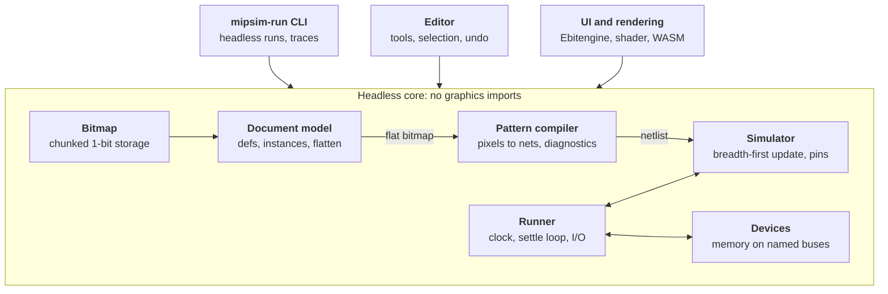

# MiPSim v2: development plan

Oct 7, 2026 · @Noé

## Status

M0 to M8 are done and merged to `master`. The headless core, the CLI and the desktop editor (drawing, selection, components, simulation, memory devices) all work. Next is M9: the owner builds a processor from the ground up, and the agent supports it. Per-milestone notes, measurements and decisions are in [docs/progress.md](docs/progress.md).

Where the build departs from the original plan below, the plan has been updated to match, and the decision is recorded in `docs/progress.md`. The main departures:

- **UI:** hand-rolled immediate-mode chrome instead of ebitenui. Text-only buttons, each showing its key, and raylib's bitmap font drawn at integer scale.
- **File dialog:** an in-app file dialog instead of a native one.
- **Memories:** configured in a Devices tab, as well as in the file.
- **Edit and file actions:** clicking selects the innermost instance; instance names are optional; New, and a save guard before replacing or closing a modified document.

## Context

MiPSim v2 is a rewrite of [Castux/mipsim](https://github.com/Castux/mipsim) in Go, with a one-bit pixel editor, reusable components, and attachable memory. This document is the handover for an AI agent building it. The specification (tile semantics, simulation, components, devices, file format) lives in [docs/SPEC.md](docs/SPEC.md).

v1 is a browser editor written in Lua and run through Fengari. Its core is three files: `Geom.lua` (613 lines, tiles to components and connections), `Simulator.lua` (268 lines) and `Canvas.lua` (735 lines, editor). Circuits are grids of five tile types: wire, power, ground, transistor, bridge. The largest real design is `bf-proc/`, a Brainfuck processor whose program and data RAM are emulated by a Lua host (`BFHost.lua`) reading and driving named wires after each clock edge.

What v2 changes:

- **Tiles:** one pixel type. Function comes from local pixel patterns, not tile kinds.
- **Reuse:** a rectangular region can be made a component and placed many times. All placements are live views of one shared definition, always drawn fully expanded.
- **Memory:** RAM and ROM become simulator devices attached to named buses, replacing hand-built RAM and ad hoc host scripts.
- **Runtime:** Go, native window on desktop, plus a headless mode with no graphics dependency. The same code is later compiled to WebAssembly for the browser (M10); desktop comes first.

What stays: the n-MOS switch-level model, low-wins-over-high, labels and the `name_N` number convention, breadth-first propagation with oscillation detection, and forcing (pinning) wires from the UI or host code.

## Goals and non-goals

Goals, in priority order:

1. A deterministic headless simulator library and CLI that can run a processor-scale circuit (bf-proc size or larger) with attached memory, driven by a clock.
2. A pattern compiler that turns a one-bit bitmap into a netlist and reports every ambiguous or malformed pattern as a located diagnostic, never silently guessing.
3. An editor on desktop, ported to the web later from the same codebase: draw, select, copy, cut, paste, move, undo, label, make and place components, simulate and force wires.
4. Live component definitions: editing any instance edits all of them immediately.

Non-goals for v2.0:

- Automatic conversion of v1 files. The geometry rules differ (v1 transistors are single tiles), so example circuits are redrawn by hand.
- Analog effects, timing, propagation delay, charge storage on floating nodes (see open questions).
- Collaborative or multi-user editing.

## Specification

The pixel language (tile semantics), the simulation model, components and instances, memory devices and the file format are specified in [docs/SPEC.md](docs/SPEC.md). References below to SPEC sections use their headings.

## Technology and setup

Use Go (latest stable release, pinned in `go.mod`) with [Ebitengine](https://ebitengine.org) for the window, input and GPU drawing. Ebitengine builds the same code for desktop and for the browser via WebAssembly, and its Kage shader language should cover the per-pixel colouring the simulator view needs (see the M0 spike below). On desktop it picks a native graphics backend per OS (OpenGL on Linux; it can be told to use OpenGL elsewhere), which satisfies the intent of "OpenGL locally" without maintaining two renderers. The agent should confirm current backend options in the Ebitengine docs during M0.

| Option | Verdict | Reason |
| --- | --- | --- |
| Ebitengine | **chosen** | One codebase for desktop and WASM, 2D pixel focus, shaders, mature |
| go-gl + GLFW, separate WebGL path | rejected | Two rendering and input backends to keep in sync |
| Gio | fallback | Strong widgets and WASM support, but less natural for a large zoomable pixel canvas |

**UI widgets.** Keep all UI inside Ebitengine so desktop and web behave identically. The M0 spike found [ebitenui](https://github.com/ebitenui/ebitenui) workable. However, the UI rework after M6 replaced it with a small hand-rolled immediate-mode chrome. It is driven by the keymap table, so every button shows its key. Text is raylib's default bitmap font (zlib licence), stored as glyph rows and drawn at integer scale, so it stays pixel-exact.

**Rendering approach.** Draw the canvas with one shader pass instead of per-pixel draw calls. Upload the visible region as two textures: pixel role (wire, source, transistor, bridge, off) and net ID packed into RGBA. Upload net states as a small lookup texture each frame. The shader colours each pixel from its role and its net's state. Only the state texture changes during simulation, so frame cost stays flat as circuits grow. The state texture is 2D (a processor can have well over 100k nets, more than one texture row allows), indexed by net ID split into row and column.

This depends on Kage reading a second source image of a different size at arbitrary texel coordinates, which Ebitengine has restricted in some versions. M0 included a spike with a pass/fail result (it passed, and the canvas shader is built this way): a shader that colours a 4096×4096 role/ID texture from a 512×512 state texture, run on desktop with the default backend and with OpenGL forced (the closest to WebGL, so the web port is unlikely to hit surprises). If it fails, the fallback is to pack the state into the same image as an atlas region, or to repaint changed nets on the CPU into a cached canvas image.

**Zoomed-out rendering (to investigate in M5).** Below 1:1, each screen pixel covers many circuit pixels. Showing a screen pixel as on when any circuit pixel under it is on turns dense logic into solid blocks, so render with area filtering (antialiasing) instead. Each circuit pixel is coloured first, from its role and net state, and the colours are then averaged over the screen pixel's footprint. Averaging must happen after colouring, because net IDs and roles cannot be interpolated. A one-pixel wire at 1/4 scale then shows as a faint line of its state colour, instead of vanishing or filling the block. With filtering, zoom-out no longer needs integer steps, and zoom can be continuous below 1:1. Candidates for the M5 spike:

- **Supersampling in the shader:** average an ordered grid of up to 4×4 samples per screen pixel from the role/ID and state textures. One pass, no extra memory; exact up to 1/4, an approximation beyond that, where aliasing (shimmer while panning) is the risk.
- **Colour then mip:** render the visible region at 1:1 into a colour image whenever net state changes, then downscale through a chain of 2×2 box averages (or Ebitengine's own mipmapped linear filter). Exact at every scale. The cost is an extra pass per state change and memory for the region, which at 1/16 is too wide for one texture, so it is tiled per chunk.
- **Contrast boost:** plain averaging makes sparse wiring faint at 1/8 and below. Try a gamma curve on coverage, and drawing net states at full saturation over a dimmed structure layer, so that signal activity stays visible on a whole-processor view.

The spike renders the synthetic processor-scale benchmark circuit at 1/2, 1/4, 1/8 and 1/16 with each candidate and with the any-on rule, records frame time and screenshots in `docs/progress.md`, and the owner picks.

**Platform layer.** File open and save go through an interface with two build-tagged implementations: native (path from the command line, save in place, in-app Save As prompt) and `js` (file input element for load, Blob download for save, via `syscall/js`). Only the native one is written before M10, but the interface is asynchronous (callbacks or results delivered on a later frame), because browser file access cannot block.

**Web later, desktop first.** Nothing web-specific is implemented before M10, but design decisions keep the port cheap:

- no cgo, `os/exec` or direct filesystem access outside `platform`;
- nothing that blocks the game loop;
- no reliance on OS threads;
- shaders limited to what WebGL supports.

CI compiles everything for `GOOS=js GOARCH=wasm` as a check (build only, not deployed or tested), so an accidental incompatibility shows up when it is introduced.

**Setup:**

```sh
# desktop editor
go run ./cmd/mipsim testdata/runner/adder4.mip

# headless
go run ./cmd/mipsim-run testdata/runner/ram.mip --set sel=1,we=1,addr=17,data=0xab --dump ram

# web (M10)
GOOS=js GOARCH=wasm go build -o web/mipsim.wasm ./cmd/mipsim
cp "$(go env GOROOT)/lib/wasm/wasm_exec.js" web/   # path differs on older Go: misc/wasm

# every check CI runs: gofmt, vet, staticcheck, tests, wasm build
scripts/check.sh
```

**CI** (GitHub Actions): install Ebitengine's Linux build dependencies first (cgo plus the X11, Xrandr, Xcursor, Xinerama, Xi, Xxf86vm and GL dev packages listed in its install docs) and `staticcheck` (`go install honnef.co/go/tools/cmd/staticcheck@latest`); otherwise `go vet ./...` fails on the `ui` package. Then vet, staticcheck, tests with `-race`, a compile-only WASM build, and a dependency check that fails if `bitmap`, `doc`, `netlist`, `sim`, `devices` or `runner` import Ebitengine (a test running `go list -deps` on those packages is enough). From M10, publish the WASM build to GitHub Pages on the main branch, as v1 does.

## Architecture and repo layout

All logic lives in a headless core of plain Go packages; the CLI, the editor and the tests are thin front ends calling the same API. The pipeline is: document, flattened to a world bitmap, compiled to a netlist, simulated, with the runner driving the clock and servicing devices.



The document flattens to a bitmap the compiler turns into a netlist; the runner owns the simulator and devices; front ends only call in.

```
mipsim2/
  go.mod
  cmd/
    mipsim/          editor entry point (desktop and wasm)
    mipsim-run/      headless CLI
  bitmap/            chunked 1-bit bitmap, rect ops, row-string codec
  doc/               definitions, instances, labels, invariants, flatten, .mip I/O
  netlist/           pattern recognition, nets, transistors, diagnostics
  sim/               switch-level simulator: Update, Step, Settle, Pin
  devices/           Device interface, memory
  runner/            clock, settle loop, named nets and numbers, traces
  editor/            tools, selection, clipboard, commands, undo (no graphics)
  ui/                Ebitengine game loop, shader canvas, chrome, panels, dialogs
    filebrowser/     the file dialog's logic (headless, unit-tested)
    fonts/           raylib's bitmap font as glyph rows
  platform/          file I/O: native.go, js.go (build tags)
  internal/
    archtest/        dependency rule checks
    mipfile/         loads .mip files from disk (core packages do no file access)
    synth/           synthetic processor-scale circuits for benchmarks
    tools/           classify (print a document's roles), synth, raylibfont
  scripts/check.sh   every check CI runs
  testdata/          fixtures (.mip with tests and checks) and goldens
  docs/              SPEC.md, progress.md, screenshot
  web/               index.html, wasm_exec.js, build script (M10)
  examples/          .mip circuits (M11)
```

Dependency direction is strictly downward: `ui` and `cmd` may import anything; `editor` imports any core package; `runner` imports `bitmap`, `doc`, `netlist`, `sim`, `devices` (it reads device configs from the document and names from the netlist); `netlist` imports `doc`, `bitmap`; `doc` imports `bitmap`; `sim` imports only `netlist` types; `bitmap` and `devices` import no module packages (devices see the circuit only through an interface they define). No package below `ui` imports Ebitengine or `syscall/js`. `internal/archtest` enforces all of this.

## Editor

The editor is a state machine over the document plus a command stack; it has no Ebitengine dependency, so every tool is unit-testable with synthetic input events. Rendering and widgets read editor state and send it events.

**Layout** (agreed with the owner after M6). The principle is that every keystroke that applies is always visible:

- **Top bar:** an Edit/Simulate switch (`e`) on the left, then the file name with a star when modified. Undo, redo, new, open and save buttons sit on the right. New, Open and closing the window ask to save a modified document first.
- **Left column:** text buttons for the current mode, each with its name and key. Actions that cannot apply right now are greyed out.
  - Edit mode: the tools (draw, select, label), then the selection actions, then the component actions (make component, explode, rename).
  - Simulate mode: run/pause (`space` tap), tick, half tick, step (`.`), reset, slower (`[`), faster (`]`), with the clock rate and tick count shown below.
- **Right panel:** tabs, shown only when there is something to show.
  - Watch, in simulate mode: every labelled net and `name_N` bus, with value and pin. Click a net to pin it as on the canvas; click a bus to type a number.
  - Memory, in simulate mode: each memory as a hex grid with the last access highlighted. Click a word to edit it while paused. Click a header to reload the init file.
  - Components, in edit mode: the palette. Click to place, right click to rename, middle click to delete an unused one. Import components... copies components (with the ones they use) from another document.
  - Devices, in edit mode: add, configure and delete memories, with a status line checking each against the circuit.
  - Diagnostics: click one to centre on it.
- **Status lines:** the first describes what the mouse and modifiers do in the current state (or the hovered button, or the prompt being typed). The second shows position, counts and messages.
- **Simulate mode** frames the canvas in v1 pink.
- **Keymap:** buttons and keys come from the same table (`ui/keymap.go`). `space` held pans in both modes; a tap without panning runs or pauses in simulate mode.
- **Palette:** MiPSim v1's (see `docs/progress.md`, "After M6").

**Edit mode tools:**

| Tool | Key | Behaviour |
| --- | --- | --- |
| Pencil | `d` | Click toggles a pixel; drag paints the value of the first pixel toggled. Holding alt during a drag locks it to a horizontal or vertical line: the axis is the dominant direction once the cursor has moved 2 pixels from the start, and stays until release |
| Select | `s` | Drag a rectangle; click selects the innermost instance under the pointer (click again for its parent) |
| Move | drag selection | Moves pixels, labels and whole instances; invariants checked on drop |
| Copy, cut, paste | `c` `x` `v` | Clipboard holds pixels, labels and linked instances; paste follows the cursor until click |
| Delete | backspace | Clears selected pixels and labels; removes selected instances |
| Mirror, rotate | `m` `r` | On the selection: pixels and labels are transformed, contained instances compose their orientation (SPEC: Components and instances). Also works on the paste preview before it is dropped |
| Label | `n` | Click a wire pixel, type a name |
| Make component | `k` | From the selection rectangle |
| Explode | `K` | On a selected instance |
| Undo, redo | ctrl+z, ctrl+y or ctrl+shift+z | Command stack, unlimited within a session |
| Pan, zoom | space+drag, wheel | Zoomed in, snaps to integer scales (n screen pixels per circuit pixel). Zoomed out, filtered rendering so a whole processor fits on screen and stays readable (Technology and setup) |

Keys are a starting proposal close to v1's (`x`, `c`, `v`, `m`, `r`, `e`); they live in one keymap table, modifiers included. Two known conflicts with alt as the line modifier: many Linux window managers take alt+drag to move the window, and in browsers a lone alt press can focus the menu bar (the `js` platform layer calls `preventDefault` on it). If alt proves unreliable on a platform, the keymap falls back to shift, which the pencil does not otherwise use. Every command records the definition it changed, so undo works across instances.

**Component cues.** Hovering shows an instance's rectangle and name. While editing inside an instance, every other instance of the same definition gets a highlighted outline so the shared edit is visible.

**Diagnostics.** Compile errors and warnings draw as markers on the canvas and list in a panel; clicking one centres the view on it. Simulation is disabled while errors exist.

**Simulate mode** (`e` toggles, as in v1): left click pins a net high, right click pins low, middle click releases. Hovering highlights the whole net and shows its names and state. Controls: run clock at N Hz, single tick, half tick, `Step()` slow motion (v1's `E`), reset. A watch panel lists labelled nets and `name_N` numbers, editable like v1's number inputs. Memory devices show as hex panels. Editing a pixel while simulating returns to edit mode and resets simulation state.

## Milestones

Build the headless core first and the editor second: M1 to M4 produce a working simulator with no graphics, which de-risks the hardest spec questions before any UI work. Each milestone ends with a short demo note in `docs/progress.md` and green CI. M0 to M8 are done (see Status).

1. **M0 Setup.** Module, CI, package skeleton, dependency check, Ebitengine window that opens on desktop, ebitenui spike, Kage lookup-texture spike (Technology and setup).
   - Done when: `go test ./...` and the compile-only WASM build pass in CI, the desktop window opens, and both spikes have a recorded pass/fail in `docs/progress.md`.
2. **M1 Bitmap and document.** Chunked bitmap, full document model including definitions, instances and orientations, all invariants, flatten, `.mip` load and save, ASCII fixture parser (fixtures can declare definitions and place instances).
   - Done when: round-trip tests pass for empty, small and 1-million-pixel documents, every invariant has a rejecting test, and the flatten/re-split property test passes.
3. **M2 Pattern compiler.** Recognition, nets, transistors, bridges, all lint rules, hierarchical label naming, patterns spanning instance boundaries.
   - Done when: every pattern and every lint code has a passing fixture; classification goldens match; a fixture with nested instances produces the expected hierarchical net names.
4. **M3 Simulator.** Breadth-first update, groups, pins, unstable detection, `Step` and `Settle`, deterministic trace output.
   - Done when: inverter, NAND, NOR, XOR, bridge crossing, SR latch, D latch and a ring oscillator (must go `Unstable`) behave correctly; two runs give identical traces.
5. **M4 Runner and CLI.** Clock driving, named nets, numbers, `mipsim-run` with `--ticks`, `--watch`, `--set`, `--trace`.
   - Done when: a 4-bit adder fixture is tested over all 512 inputs from Go and from the CLI.
6. **M5 Minimal editor.** Shader canvas, pan, zoom, zoomed-out rendering spike (Technology and setup), pencil with alt line lock, simulate mode with pinning and net hover, on desktop.
   - Done when: the owner can draw an inverter in the desktop editor and toggle it.
7. **M6 Editing conveniences.** Select, move, copy, cut, paste, delete, mirror and rotate (including instances in the selection and the paste preview), labels, undo and redo, diagnostics panel, native file open and save.
8. **M7 Component UI.** The data model already exists from M1/M2. This adds deep hit-testing, the make component, place, explode, resize and rename commands with undo, instance outlines and cues, and the palette. Editor commands from M5/M6 resolve edits to (definition, local coordinate) from the start, so they work inside instances without changes.
   - Done when: an 8-bit adder built from 8 instances of one full adder works, and editing one instance changes all 8 on screen and in simulation.
9. **M8 Memory devices.** Device interface, memory device, settle loop, document config, hex panel.
   - Done when: a test circuit reads and writes a 256-byte RAM through a bus, from the CLI and in the editor.
10. **M9 Real workload.** The owner builds a full 8-bit processor from the ground up in the editor; there is no prepared library of building blocks. The agent's part: fixes and features the owner needs along the way, a test harness for the processor, and profiling on it.
    - This milestone depends on the owner finishing the processor; the agent's part is done when the harness runs it and the benchmarks meet budget on it.
    - Done when: the owner's processor runs a test program headless with memory attached; compile under 50 ms and at least 1,000 clock ticks per second headless on a laptop, or a profiling report explains the gap.
11. **M10 Web port.** `js` platform layer (file input, Blob download, memory init upload), `web/` page and build script, browser-specific input fixes (alt and other keys the browser intercepts), WebGL check of the shaders, GitHub Pages deployment.
    - Done when: the owner can open, edit, simulate and save a document with memory attached in the browser, from the published Pages site.
12. **M11 Polish.** Slow-motion stepping view, watch panel numbers, example gallery, README and user guide, on desktop and web.

## Testing

Most tests are fixtures in `testdata/`: ordinary `.mip` documents whose rows of `#` and `.` keep a failing case readable in a diff. A fixture carries its expectations in the optional `tests` (a script of pins and expected values) and `checks` (structural assertions) fields, described in `docs/SPEC.md`:

```json
{
  "format": "mipsim",
  "version": 2,
  "root": "top",
  "defs": {
    "top": {
      "origin": [0, 0],
      "rows": ["###", "###", "###", ".#", "#########", ".#", "##", ".#", "###", "#.#", "###"],
      "labels": [{"x": 0, "y": 6, "name": "in"}, {"x": 8, "y": 4, "name": "out"}]
    }
  },
  "tests": [
    {"set": {"in": "low"}, "expect": {"out": "high"}},
    {"set": {"in": "high"}, "expect": {"out": "low"}}
  ]
}
```

Reading it: a high source on top feeds a cross junction at row 4 (left arm is a stub, right arm is the output). Below, the transistor at (1,6) has its channel vertical and its gate arm to the left (the input). The channel's lower end reaches a low source ring. Input high makes the channel conduct, the output net joins the ring, and low wins.

Test layers:

- **Classification goldens:** the compiler's role map printed as letters (`H` high, `L` low, `T` transistor, `B` bridge, `w` wire, `.` off) compared against a stored golden, regenerated with `go test -update` and reviewed by hand.
- **Diagnostics:** each lint code has at least one fixture that triggers it and one near-miss that must not.
- **Behaviour:** each test step pins nets, settles, and checks values; numeric buses use `{"set": {"a": 5, "b": 3}, "expect": {"sum": 8}}`.
- **Determinism:** run each behaviour fixture twice and compare full traces.
- **Property tests:** random small bitmaps must either compile or produce diagnostics, never panic; flatten then re-split of random instance trees, with random orientations, preserves pixels.
- **Orientation invariance:** every classification and behaviour fixture is also run in all 8 orientations, both as a transformed bitmap and wrapped in an oriented instance. The role map must transform accordingly, and the behaviour expectations must still pass.
- **Editor commands:** scripted event sequences against the editor state, checked by document snapshots, including undo of every command.
- **Benchmarks:** compile and tick benchmarks, tracked in CI output. Until the owner's M9 processor exists, run them on synthetic circuits generated by a test helper: tiled full adders, register files and counters scaled to about 1 million on pixels and 20,000 transistors. The compile benchmark starts in M2, the tick benchmark in M3, so the budgets in goal 1 are tracked long before M9.

## Rules for the agent

1. Read the v1 sources (`Simulator.lua`, `Geom.lua`, `bf-proc/BFHost.lua`) before M3 and M8; v2 behaviour should match v1 wherever this spec does not say otherwise.
2. `docs/SPEC.md` is the only copy of the spec (split out of this plan in M0). Any behaviour change updates it and adds a fixture in the same commit.
3. Core packages (`bitmap`, `doc`, `netlist`, `sim`, `devices`, `runner`, `editor`, and `ui/filebrowser`) never import graphics, `syscall/js` or `os`. They get file access through callbacks.
4. No map iteration in `bitmap`, `doc` (flatten), `netlist`, `sim` or `runner`. Use slices and stable ordering.
5. One milestone per branch, small commits, pushed after each significant piece of work, CI green before merging to `master`. Update `docs/progress.md` with what works, what does not, and decisions made.
6. When the spec is ambiguous, choose the simplest behaviour that is testable, record it under "Decisions" in `docs/progress.md`, and flag it for the owner. Do not guess on the open questions below; implement the stated default.
7. Prefer standard library over dependencies. The only direct dependency is Ebitengine. Anything else gets a one-line justification in `docs/progress.md`.
8. Desktop first: do not implement web-specific code before M10, but follow the "web later" constraints in Technology and setup so the port stays cheap.

## Open questions for the owner

Each has a default the agent implements until the owner decides.

| Question | Decision |
| --- | --- |
| One-pixel-wide wires (`E_THICK`) or isolated sources with thick wires allowed? | Decided: thin wires (`E_THICK`), after the M2 comparison |
| Should floating nets keep their last value or go `Floating` like v1? | `Floating`, as v1 |
| When does `Unstable` clear? | Decided: at the start of the next settle (differs from v1, which kept it until reset) |
| Do instances need rotation and mirroring? | Decided: yes, all 8 orientations, in the data model from M1 |
| New repo (`mipsim2`) or a `v2/` directory in `mipsim`? | New repo, linked from the v1 README |
| Memory writes: level-sensitive at each settle or on a strobe edge? | Level-sensitive, as v1 |
| Memory reading a `Floating` or `Unstable` bit? | Decided: runtime error, except that a floating `select` means idle (SPEC: Memory devices and buses) |
| Clock net name: fixed `clock` or per document? | Per document, defaulting to `clock` |
| Which processor is the M9 workload? | A full 8-bit processor, built from the ground up by the owner; no prepared component library |
| Flip threshold for `Unstable` | 20, configurable; trips when a count goes above it, as in v1 |
| Are diagonal-only touches ever meaningful? | Decided: never connect; warn with `W_DIAGONAL_TOUCH` |
