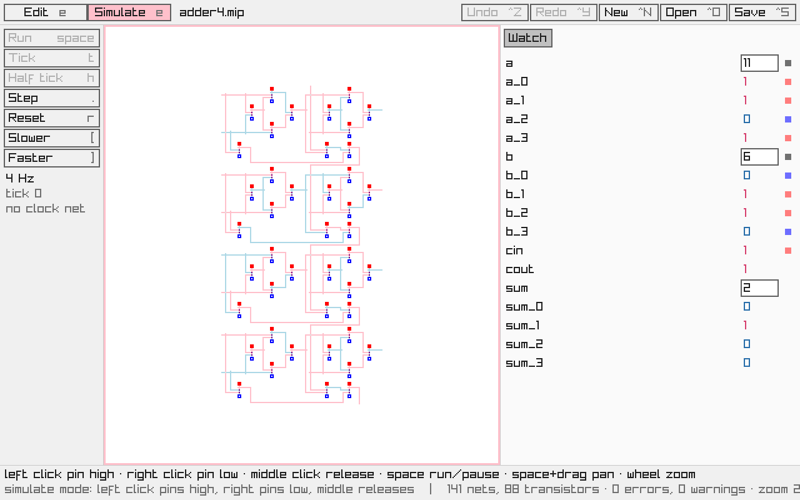

# MiPSim v2

A switch-level n-MOS circuit simulator where circuits are drawn as one-bit pixel art. It is a Go rewrite of [MiPSim](https://github.com/Castux/mipsim), adding reusable components and attachable memory.



Circuits are made of a single kind of pixel. What a pixel does comes from the pattern around it:

```
High source   Low source    Transistor    Bridge        Wire junction
  ###           ###           .#.           .#.           .#.
  ###           #.#           ###           #.#           ###
  ###           ###           ...           .#.           .#.
```

A 3×3 square pulls its wire high, and a 3×3 ring pulls it low (low wins). A T shape is a transistor whose stem is the gate. A gap surrounded by four wire ends lets two wires cross. The full rules are in [docs/SPEC.md](docs/SPEC.md).

## Features

- **Drawing:** a pencil with an axis lock (alt), select, move, copy and paste, rotate and mirror, labels, and unlimited undo.
- **Diagnostics:** malformed or ambiguous patterns are reported at their location and listed in a panel.
- **Components:** make a component from a selection and place it anywhere, in any of 8 orientations. Every placement is a live view, so editing one edits them all. Net names are hierarchical (`alu.add3.sum_2`). Components can be imported from other documents, along with the components they use.
- **Simulation:** click a wire to pin it high or low, then run a clock, tick, or step one propagation at a time. Labels ending in `_0`, `_1`, ... read as numbers in the Watch panel, where you can also type values.
- **Memory:** RAM and ROM devices attach to labelled buses. Configure them in the Devices tab, load their contents from a binary file, and view or edit them as hex while simulating.
- **Headless runs:** `mipsim-run` runs a circuit from the command line, with pins, clock ticks, traces and memory dumps.

## Status

Milestones M0 to M8 of [PLAN.md](PLAN.md) are done: the simulator core, the CLI, and the desktop editor with components and memory. Next is building a full 8-bit processor in it (M9), then a web version (M10). [docs/progress.md](docs/progress.md) logs what was built and why.

## Building and running

You need Go 1.26 or later. On Linux, Ebitengine also needs the X11 and OpenGL development packages; see the [Ebitengine install guide](https://ebitengine.org/en/documents/install.html).

```sh
go run ./cmd/mipsim circuit.mip                 # edit a circuit (created on first save)
go run ./cmd/mipsim testdata/runner/adder4.fix  # open a test fixture
go run ./cmd/mipsim-run testdata/runner/adder4.fix --set a=3,b=5,cin=0 --watch sum,cout
go run ./cmd/mipsim-run testdata/runner/ram.fix --set sel=1,we=1,addr=17,data=0xab --dump ram
go test ./...                                   # run the tests
scripts/check.sh                                # every check CI runs
```

In the editor every action is a button showing its key, and the bottom line explains what the mouse does right now. `e` switches between edit and simulate mode. In simulate mode, left click pins a wire high, right click pins it low and middle click releases it; tap space to run the clock. Hold space and drag to pan, and use the wheel to zoom.

## Files

Documents are `.mip` files: deterministic, line-oriented JSON in which pixels are rows of `#` and `.`, so circuits diff well in git. Test fixtures (`.fix`) use the same rows plus directives, and the editor opens them too. The format is in [docs/SPEC.md](docs/SPEC.md), and the fixture syntax in `internal/fixture`.

## Layout

| Path | Contents |
| --- | --- |
| `bitmap/` | Unbounded one-bit images |
| `doc/` | Documents, components, orientations, `.mip` files |
| `netlist/` | Pattern compiler: pixels to nets and transistors, with diagnostics |
| `sim/` | Switch-level simulator |
| `runner/`, `devices/` | Clocked runner, named nets and buses, memory devices |
| `editor/` | Editor logic: tools, selection, components, undo (no graphics, unit-tested) |
| `ui/`, `platform/` | Ebitengine front end, file access for desktop (and web later) |
| `cmd/` | `mipsim` (editor) and `mipsim-run` (headless CLI) |
| `internal/` | Fixture parser, dependency checks, benchmark circuits, dev tools |
| `testdata/` | ASCII circuit fixtures and classification goldens |

## License

[MIT](LICENSE). The UI font is raylib's default font, Copyright (c) Ramon Santamaria, under the zlib licence (notice in `ui/fonts/raylib.go`).
